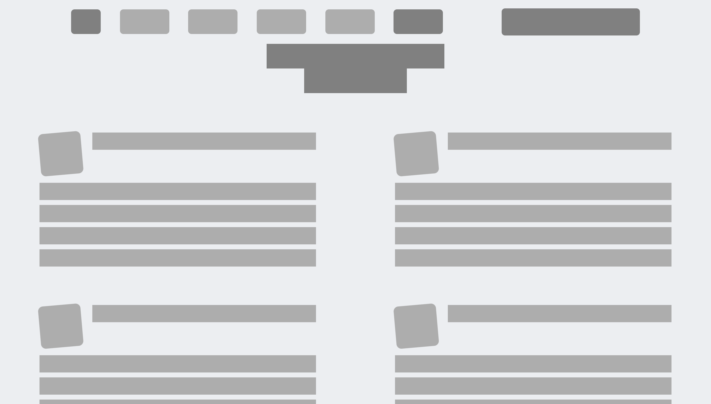

# Design Teardown

> Web Page that resembles tha design of Smashing Magazine

## Built With

- HTML5
- CSS3

## Live Demo

[Live Demo Link](https://raw.githack.com/zdrale/DesignTearDown/Fature-Branch/index.html)

## Authors

👤 **Silas Kalu**

- GitHub: [@cyonii ](https://github.com/cyonii )
- LinkedIn: [@silas-kalu](https://www.linkedin.com/in/silas-kalu-2a9a13199/ )

👤 **Nikola Zdrale**

- GitHub: [@zdrale](https://github.com/zdrale)
- Twitter: [@zdralenikola](https://twitter.com/zdralenikola)
- LinkedIn: [@nikola-zdrale](https://www.linkedin.com/in/nikola-zdrale/)

## 🤝 Contributing

Contributions, issues, and feature requests are welcome!

